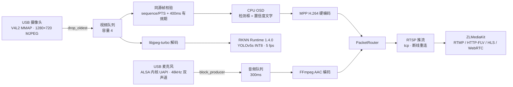

# RK3568 实时音视频边缘分析网关

[](https://github.com/cccoddad/rk3568-edge-av-gateway/actions/workflows/ci.yml)
[](LICENSE)

> **English summary.** A production-grade real-time audio/video edge analytics gateway for
> RK3568 (ARM64, Buildroot Linux): V4L2/ALSA capture → RKNN NPU YOLOv5 detection →
> CPU OSD overlay → MPP H.264 + AAC encode → RTSP push into ZLMediaKit with
> RTMP / HTTP-FLV / HLS / WebRTC distribution. A single process with six worker threads
> and bounded queues. Verified by a **120-hour continuous soak** — one uninterrupted run,
> zero restarts, zero pipeline errors, **24.5M packets pushed with zero drop**,
> p99 overlay latency **2.5 ms** — plus 66 automated tests under Debug and ASan/UBSan.
> All numbers are reproducible; see [docs/BENCHMARKS.md](docs/BENCHMARKS.md).


*实板输出实拍：1280×720 MJPEG 摄像头画面上叠加 YOLOv5 检测框、类别置信度与网关 OSD 信息。*

## 项目亮点

1. **全链路自主实现**：从 USB 设备驱动接入、NPU 推理、OSD 叠加到硬件编码与多协议流媒体
   分发，单进程 6 线程有界队列管道，每类数据独立的背压策略（丢旧 / 保留最新 / 阻塞）。
2. **工业级长稳证据**：120 小时单次连续运行零重启、零错误、推流零丢包——
   每个数字都有结果目录、SHA-256 清单与结构化日志可复核（[基准数据](docs/BENCHMARKS.md)）。
3. **Mock 先行的回归方法**：66 项自动化测试在无硬件环境下全量运行，
   硬件后端逐个替换而不动公共数据契约与主流程；CI 覆盖 clang-format / clang-tidy /
   Debug / ASan+UBSan。
4. **严格的配置契约**：字段拼写、类型、范围、后端可用性全部在**线程启动前**校验拒绝，
   `--validate-config` 可独立执行。
5. **自愈与可运维**：崩溃 5 秒自动拉起、SIGTERM 优雅停止、开机自启（SysV 守护），
   SSH / adb / 串口三通道运维。

## 核心指标（实测，2026-10 完成）

| 指标 | 实测值 |
|---|---|
| 120 小时连续长稳 | 单次运行 432,000 s，零重启，exit 0 |
| 管线错误 / 自动恢复 / 队列异常 | 0 / 0 / 设计内策略丢弃 0.031%（编码入口） |
| RTSP 推流 | 24,537,112 包，**零丢包** |
| OSD 叠加延迟 | p99 **2.5 ms**（帧周期 33 ms 的 1/13） |
| NPU 推理 | 1,558,667 次，请求=结果 **100%**，p99 125.7 ms |
| 异常帧容错 | 跳帧率 0.0011%，零崩溃（USB 截断帧自动容错） |
| 端到端播放延迟 | 0.3~0.7 s（WebRTC，最差 1.1 s） |
| 自动化测试 | **66/66** 全绿（Debug + ASan/UBSan） |

## 系统架构



| 设计点 | 方案 |
|---|---|
| 并发模型 | 6 个 worker 线程 + 每输出端独立线程，全部经有界队列 |
| 队列语义 | 视频丢旧保新鲜、推理保最新、音频背压阻塞——策略跟数据语义走 |
| 错误处理 | `Result<T>` 分类预期故障；致命错误结构化带根因退出 |
| 运行监控 | JSON 行日志 + 周期指标（延迟分位/队列水位/最近进展）+ 线程健康看门狗 |

## 快速开始

**Windows**（仓库路径含特殊字符，经短路径 Junction 构建）：

```powershell
powershell -ExecutionPolicy Bypass -File .\tools\build_windows.ps1
```

**Linux / Ubuntu**：

```bash
sudo apt install -y build-essential cmake ninja-build git
sh ./tools/build_and_test.sh
```

**手动三步**：

```bash
cmake --preset debug && cmake --build --preset debug -j4
ctest --preset debug                                  # 66 项测试
./build/debug/rkav-gateway --validate-config --config config/mock.json
./build/debug/rkav-gateway --config config/mock.json --duration 0   # 跑到 SIGTERM
```

**板端（RK3568）**：交叉编译产物与部署步骤见
[docs/09-Buildroot交叉编译与RK3568上板阶段总结](docs/09-Buildroot交叉编译与RK3568上板阶段总结.md)；
板端一键冒烟 / 长稳工具见 [tools/board_osd_run.sh](tools/board_osd_run.sh)。

## 测试与质量

```text
100% tests passed, 0 tests failed out of 66
```

- 单元测试覆盖队列策略、配置契约、错误分类、OSD 坐标变换、JPEG 坏帧恢复；
- 集成测试跑整条 Mock 管道（含慢推理、限速、设备失联场景）；
- `asan` 预设（ASan+UBSan）已抓出并修复过 RTSP 重连 FD 泄漏；
- 配置/格式/静态检查由 [CI](.github/workflows/ci.yml) 强制。

## 文档导航

| 文档 | 内容 |
|---|---|
| [docs/BENCHMARKS.md](docs/BENCHMARKS.md) | 实测基准：长稳阶梯、延迟分位、资源、复现判据 |
| [docs/ENGINEERING-NOTES.md](docs/ENGINEERING-NOTES.md) | 十个代表性问题的根因分析与设计决策 |
| [docs/CONVENTIONS.md](docs/CONVENTIONS.md) | 编码、验收证据、板端安全、Git 约定 |
| [docs/01-项目总体代码架构.md](docs/01-项目总体代码架构.md) | 架构与模块边界 |
| [docs/04-项目配置说明.md](docs/04-项目配置说明.md) | 配置字段与语义 |
| [docs/19-项目当前开发状态.md](docs/19-项目当前开发状态.md) | 当前状态与路线 |
| [docs/](docs/) | 阶段验收与交接记录（按编号） |

## 已知观察项

工程上如实记录而非隐藏（详见 [BENCHMARKS §4](docs/BENCHMARKS.md)）：

- 板级偶发网络失联已 5 次，均有串口取证与恢复规程，根因线索已归档（持续观察）；
- USB 传输 0.0011% 概率的截断帧由解码层容错丢弃，不产生花屏；
- 板载 RTC 失效，冷启动需对时（已纳入运维规程）。

## 许可证

[MIT](LICENSE)
